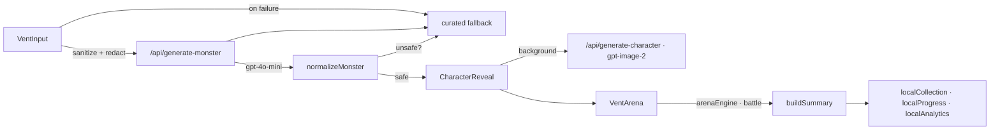

# Unhappy Buster

A private, playful stress-reset app that turns an everyday frustration into a ridiculous symbolic monster, then closes the loop with a 30-second cartoon boss fight.

## Live Demo

Try it now: [fuck-your-unhappy.vercel.app](https://fuck-your-unhappy.vercel.app)

Name the bad vibe, watch it become a fictional stress monster, bonk it in a cartoon arena, check how you feel, then share a spoiler-free victory card.

> **Naming** — the product is **Unhappy Buster** (short: FYU). The repository name `fuck-your-unhappy` is the original codename; public-facing copy, metadata, and share cards all use the product name.

## Screenshots

Recent viewport captures from local production builds live in [`output/`](output/) (`audit/`, `retention-audit/`, `retention-build/`), each with a README describing what was verified and the evidence limits. Re-run the flow locally and drop fresh captures here before a public launch.

## Problem

Most wellness products ask for time and seriousness exactly when a person has neither. Unhappy Buster offers a short, funny reset without pretending to be therapy or encouraging real-world harm.

## Solution

**Unhappy Buster** (FYU) gives users a fast, funny release loop. Real names and contact details are redacted before generation, unsafe inputs are stopped before AI processing, and the combat is explicitly metaphorical.

## Demo Flow

```
Name it → Meet the monster → 30-second arena → Check in and close
```

1. **Name it** — Enter a short frustration or pick a low-effort prompt
2. **Meet it** — See an instant mascot-backed reveal while a custom portrait can load in the background
3. **Release it** — Choose a silly prop and scene, then use Bonk, Smush, Roast, and Rage for up to 30 seconds
4. **Close it** — Get an honest defeated/released/named outcome, check your mood, take a small next step, and optionally share a safe card

## Core Features (MVP)

- Fast AI-assisted monster profiles with curated offline fallbacks
- Immediate reveal with generated portrait enhancement in the background
- PII redaction and sensitive-input gates on both text and image routes
- Compact 30-second mobile arena with haptics, opt-in voice, Rage Mode, combo, and reduced-motion support
- Countdown starts on the first attack, so reading the boss cue never burns play time
- Counter-based Bonk / Smush / Roast strategy, a stronger phase two, and a dedicated finishing move
- Honest closure outcomes that never label a single hit as a victory
- One-tap scenarios, a rotating curated Daily Boss, and allowlisted raw-text-free challenge links
- Local field guide, unlockable props/scenes/finishers, and privacy-friendly aggregate funnel counters
- Mood check, small next step, private local streak, and raw-text-free share cards
- Responsive layout for mobile and desktop

## Tech Stack

| Layer | Tech |
|-------|------|
| Framework | Next.js 16 (App Router) |
| Language | TypeScript |
| Styling | Tailwind CSS 4 |
| Animation | Framer Motion |
| Runtime | React 19 |
| AI | OpenAI API with curated local fallback content |

## Architecture



- **One screen, four states** — `input → reveal → arena → summary`, orchestrated by `src/app/page.tsx`.
- **Pure logic layer** — `arenaEngine` (intents/counters/phase-2/finisher), `dailyBoss` (UTC rotation + allowlisted challenge URLs), `safety` (redaction + gates), `localCollection`/`localProgress`/`localAnalytics` (schema-versioned local storage). All randomness and time are injected so the logic is deterministically unit-tested.
- **Server routes** — two OpenAI-backed endpoints with input sanitization, per-key request gates (in-memory + optional Upstash), schema normalization, unsafe-output scans, and curated offline fallbacks on any transport/model failure.
- **Local-first state** — no accounts, no backend. Progression, unlocks, streaks, and aggregate counters live in `localStorage` with defensive parsing and a two-step clear control.

## Run Locally

```bash
git clone https://github.com/bobaoxu2001/fuck-your-unhappy.git
cd fuck-your-unhappy
npm install
cp .env.example .env.local
npm run dev
```

Add your OpenAI key to `.env.local`:

```bash
OPENAI_API_KEY=sk-your-key-here
```

Open [http://localhost:3000](http://localhost:3000). The app still works without an API key by using curated fallback monsters.

## Scripts

```bash
npm run dev
npm run lint
npm run typecheck
npm run test
npm run build
npm run start
```

## Environment Variables

| Variable | Required | Notes |
|----------|----------|-------|
| `OPENAI_API_KEY` | Optional | Used server-side for monster copy and custom portraits; the curated experience still works without it |
| `DISABLE_IMAGE_GENERATION` | Optional | Set to `true` to pause custom portraits without taking the app down |
| `UPSTASH_REDIS_REST_URL` | Optional | Shared rate-limit store so serverless instances share one AI budget; also stores anonymous product analytics counters (separate `fyua:` key prefix) |
| `UPSTASH_REDIS_REST_TOKEN` | Optional | Companion token for the Upstash REST gate |
| `NEXT_PUBLIC_ANALYTICS_ENABLED` | Optional | Set to `true` **only in Vercel Production** env vars to collect anonymous PMF events. Unset everywhere else so dev/preview/local builds never pollute production analytics |
| `ANALYTICS_REPORT_KEY` | Optional | Secret query key for the founder-only report at `/api/analytics/report?key=…` |

## Deployment

This app is Vercel-ready.

1. Import the GitHub repo into Vercel.
2. Add `OPENAI_API_KEY` in Project Settings → Environment Variables.
3. Deploy with the default Next.js settings.
4. Run `npm run build` locally before pushing major changes.

## Safety Notes

- The app is a brief comedy reset, not therapy, crisis support, or an encouragement of real-world harm.
- The app does not persist raw vent text. Only streaks, fictional monster metadata, bounded play stats, unlock state, and allowlisted aggregate event counts are stored locally on the device.
- When product analytics is enabled in production, the app additionally sends anonymous product events (visit / start / boss reveal / arena start / arena completion / share with bounded enum labels) plus two random local IDs to the project's own Upstash store. Vent text, redacted vent text, prompts, names, contacts, boss descriptions, share text, and AI responses are structurally excluded from the event schema and rejected by the server validator. No cookies, no fingerprinting, no accounts.
- Names, emails, and phone-like strings are redacted before an AI request is built.
- Self-harm, violent, hateful, or sexual inputs are stopped before text or image generation and receive a supportive redirect.
- Generated portraits use structured fictional monster traits rather than the original vent text.
- API keys stay server-side and `.env.local` is ignored by git.

## Limitations & Next Validation Steps

What this build is not:

- **Not therapy or crisis support** — it is a short comedy reset; see the Safety Notes below.
- **No cross-device sync** — progression is per-browser by design.
- **Best-effort input gates** — safety screening is pattern-based and can be paraphrased around; the model system prompt and output scans are a second layer, not a guarantee.
- **Per-instance rate limits** — the in-memory gate resets per serverless instance; a durable shared gate requires Upstash (see below).
- **No real-user evidence yet** — the mechanics are proven locally, not retention or efficacy claims.

Next validation steps before scaling:

- Run opt-in user tests before claiming retention lift
- Add abuse/cost controls suitable for high-volume AI generation
- Compare safe challenge-card formats and first-session activation copy
- Cohort analytics now exist: a minimal anonymous, payload-free PMF measurement layer (see **PMF Measurement** below). Enable it in production with `NEXT_PUBLIC_ANALYTICS_ENABLED=true` plus the Upstash env vars and `ANALYTICS_REPORT_KEY`
- Set `UPSTASH_REDIS_REST_URL` and `UPSTASH_REDIS_REST_TOKEN` before a high-volume public launch so the AI gate is shared across instances

## PMF Measurement (anonymous, production-gated)

Before monetization, Unhappy Buster measures real commercial behavior with six anonymous core events, collected **only** when `NEXT_PUBLIC_ANALYTICS_ENABLED=true` is set in Vercel Production and Upstash storage is configured. Development, preview, and local builds never send anything. Analytics always fails open: if the endpoint or store is unavailable, gameplay is completely unaffected.

| Event | Trigger | Properties |
|-------|---------|------------|
| `visit` | Page load, once per tab session | — |
| `start` | Explicit loop start (vent submit, scenario chip, daily boss, challenge), once per session | `entry_type`: organic (typed vent) / custom (scenario chip) / daily / challenge |
| `boss_revealed` | Boss reveal shown (AI result or public boss) | `boss_source`: custom / scenario / daily / challenge · `generation_mode`: live_ai / curated_fallback (custom & scenario only) |
| `arena_started` | Arena actually begins | `boss_source`, `generation_mode?` |
| `arena_completed` | Genuine terminal outcome (defeated / released / named) | `boss_source`, `generation_mode?`, `result`, `duration_bucket` (under_10 / 10_to_20 / 20_to_30 / over_30) |
| `share` | User invokes a share action | `channel`: native / download |

Every event also carries: a random anonymous installation ID (localStorage), a random per-tab session ID (sessionStorage), a server timestamp, and normalized UTM labels (`utm_source` / `utm_medium` / `utm_campaign`, lowercase `[a-z0-9._-]`, ≤48 chars) when present. The server rejects any event with unknown keys or non-enum values, so vent content is structurally impossible to store.

**Measurable funnel:** visit → start → boss_revealed → arena_started → arena_completed → share. Custom-boss generation = `boss_revealed` with `boss_source` custom/scenario. Second fight = session with 2+ `arena_completed` the same UTC day. D1 = installs completing on day X that also completed on day X+1. D7 = installs completing on day X that also completed on days X+6…X+8. North star = installs completing on 2+ distinct days in the last 7 days.

**Founder report (30-day PMF view, no dashboard):**

```bash
curl "https://fuck-your-unhappy.vercel.app/api/analytics/report?key=$ANALYTICS_REPORT_KEY&days=14"
```

Returns daily visitors/starts/reveals/arena-starts/completions/shares, funnel rates (activation, boss reveal, arena start, arena completion, share rate), second fights, D1/D7, the north-star count, completes & D1 per UTM source, completion per boss source (daily vs custom vs challenge vs scenario), live-AI vs curated-fallback completion, outcomes, and share channels.

**Campaign link convention** (`boss_of_the_day_01`):

| Channel | URL |
|---------|-----|
| TikTok | https://fuck-your-unhappy.vercel.app/?utm_source=tiktok&utm_medium=organic&utm_campaign=boss_of_the_day_01 |
| Instagram Reels | https://fuck-your-unhappy.vercel.app/?utm_source=instagram&utm_medium=organic&utm_campaign=boss_of_the_day_01 |
| Reddit | https://fuck-your-unhappy.vercel.app/?utm_source=reddit&utm_medium=community&utm_campaign=boss_of_the_day_01 |
| Slack / direct shares | https://fuck-your-unhappy.vercel.app/?utm_source=slack&utm_medium=direct&utm_campaign=boss_of_the_day_01 |
| Warm outreach | https://fuck-your-unhappy.vercel.app/?utm_source=outreach&utm_medium=warm&utm_campaign=boss_of_the_day_01 |
| X | https://fuck-your-unhappy.vercel.app/?utm_source=x&utm_medium=organic&utm_campaign=boss_of_the_day_01 |

Users can reset their anonymous analytics ID any time via Field Guide → Clear data (privacy page documents this). Remote counters self-expire after ~95 days.

## License

MIT
